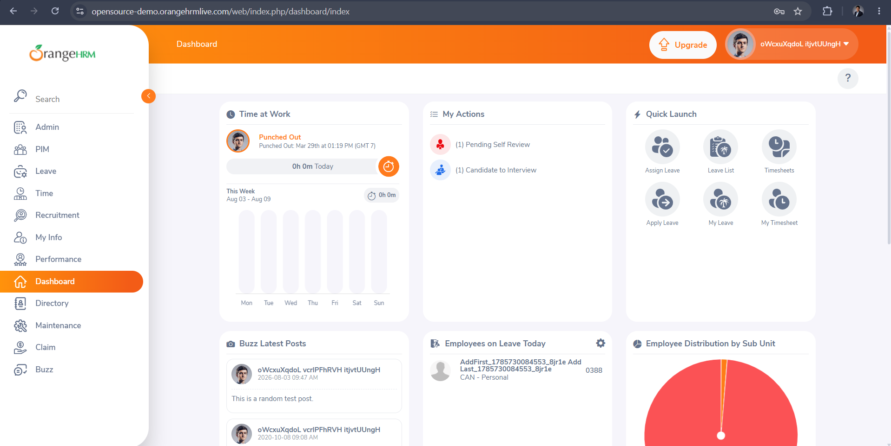
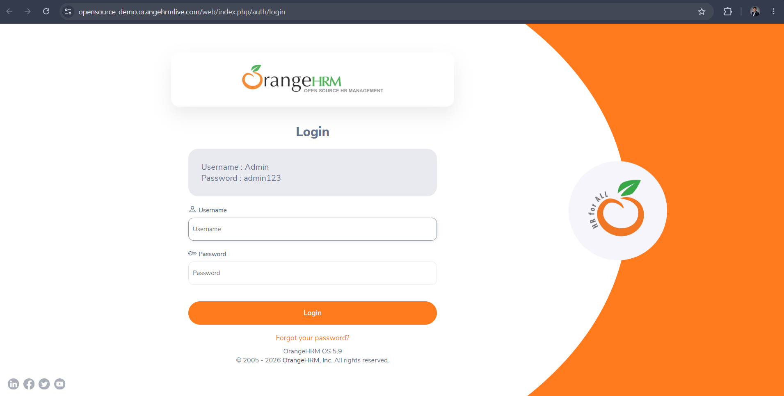
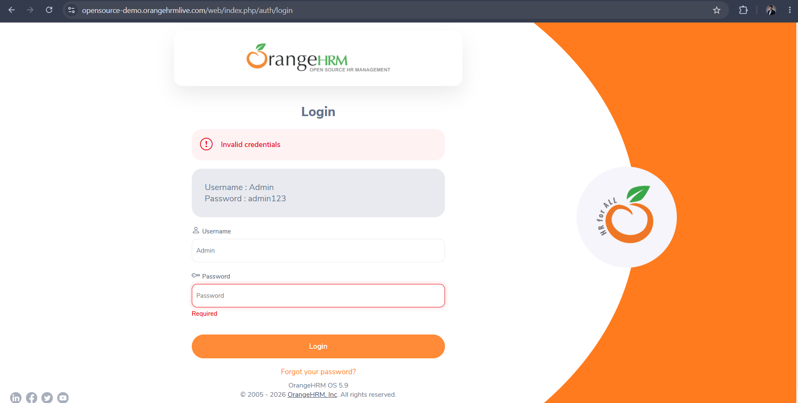

# OrangeHRM Login Testing Project


## Project Overview

This project demonstrates **Manual Testing** of the **Login Module** of the OrangeHRM Demo application.

The objective of this project is to validate the login functionality by performing:

- Test Planning
- Test Scenario Design
- Test Case Design
- Test Execution
- Bug Reporting
- Requirement Traceability
- Test Metrics & Summary Reporting
- Documentation

This project is part of my QA Portfolio and showcases my understanding of software testing concepts and practical testing skills.

---

## Application Details

| Field | Details |
|--------|---------|
| Application | OrangeHRM Demo |
| Module | Login |
| URL | https://opensource-demo.orangehrmlive.com/ |
| Testing Type | Manual Testing |
| Browser | Google Chrome (Latest) |
| Operating System | Windows 11 |

---

## Test Credentials

| Username | Password |
|-----------|----------|
| Admin | admin123 |

---

## Project Structure

```text
OrangeHRM-Login-Testing
│
├── 01-Test-Plan
│   └── Test-Plan.md
│
├── 02-Test-Scenarios
│   └── Login-Test-Scenarios.md
│
├── 03-Test-Cases
│   └── Login-Test-Cases.md
│
├── 04-Test-Execution
│   ├── Test-Execution-Report.md
│   └── Execution-Summary.md
│
├── 05-Bug-Reports
│   └── Bug-Report.md
│
├── 06-Screenshots
│   ├── Login-Page.png
│   ├── Dashboard.png
│   ├── Logout-Page.png
│   ├── Invalid-Login.png
│   └── Validation-Message.png
│
├── 07-Test-Data
│   └── Test-Data.md
│
├── 08-RTM
│   └── Requirement-Traceability-Matrix.md
│
├── 09-Test-Metrics
│   └── Test-Metrics.md
│
├── 10-Test-Summary
│   └── Test-Summary-Report.md
│
└── README.md
```

---

## Documentation

| Folder | Contents |
|---|---|
| [01-Test-Plan](./01-Test-Plan) | Test plan: scope, approach, and objectives |
| [02-Test-Scenarios](./02-Test-Scenarios) | High-level login test scenarios |
| [03-Test-Cases](./03-Test-Cases) | Detailed step-by-step test cases |
| [04-Test-Execution](./04-Test-Execution) | Execution report and results summary |
| [05-Bug-Reports](./05-Bug-Reports) | Defects logged during testing |
| [06-Screenshots](./06-Screenshots) | Screenshots captured during test execution |
| [07-Test-Data](./07-Test-Data) | Test data used across test cases |
| [08-RTM](./08-RTM) | Requirement Traceability Matrix mapping requirements to test cases |
| [09-Test-Metrics](./09-Test-Metrics) | Test coverage and execution metrics |
| [10-Test-Summary](./10-Test-Summary) | Final test summary report |

---

## Screenshots

A few captures from test execution — full set available in [06-Screenshots](./06-Screenshots).

<p>
  
  
  
  
  
</p>

---

## Testing Scope

The Login module was tested for the following functionalities:

- Login page accessibility
- Username validation
- Password validation
- Successful login
- Invalid login
- Required field validation
- Password masking
- Logout
- Session management
- Browser behavior

---

## Test Summary

| Activity | Status |
|----------|--------|
| Test Plan | Completed |
| Test Scenarios | Completed |
| Test Cases | Completed |
| Smoke Testing | Completed |
| Functional Testing | Completed |
| Exploratory Testing | Completed |
| Bug Reporting | Completed |
| Requirement Traceability Matrix | Completed |
| Test Metrics | Completed |
| Test Summary Report | Completed |

---

## Tools Used

- Google Chrome
- GitHub
- Markdown
- Microsoft Excel (for initial documentation)

---

## Learning Outcomes

Through this project, I learned how to:

- Create a professional Test Plan
- Design effective Test Scenarios
- Write detailed Test Cases
- Execute manual test cases
- Record execution results
- Report software defects
- Build a Requirement Traceability Matrix
- Calculate and report test metrics
- Organize QA documentation professionally

---

## Author

**Swapnali Shitole**

Aspiring QA Engineer | Manual Testing | Software Testing | GitHub Portfolio Development
