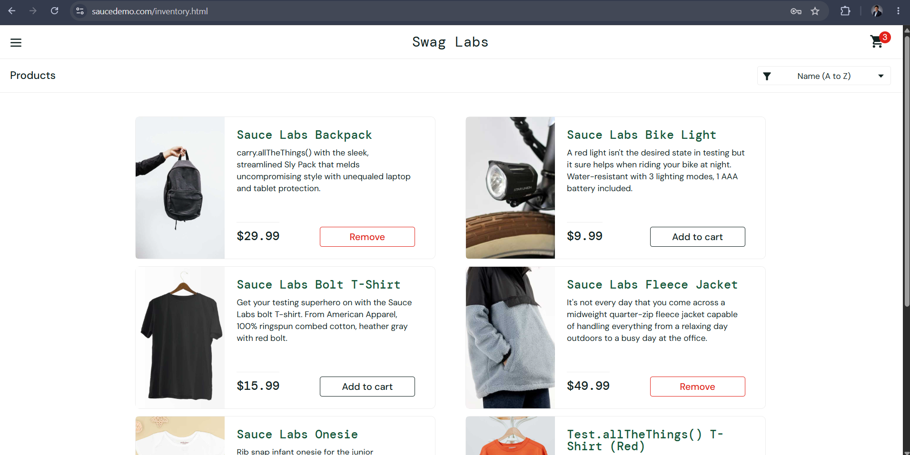
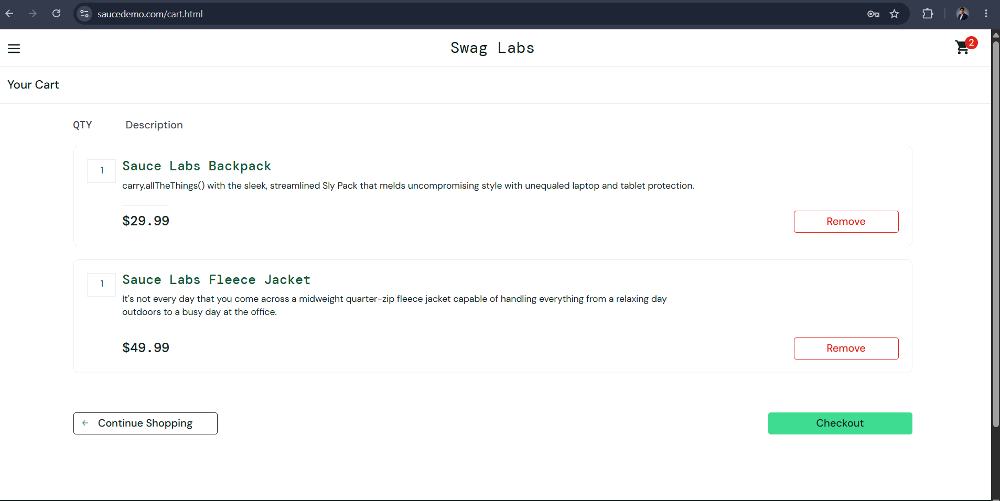
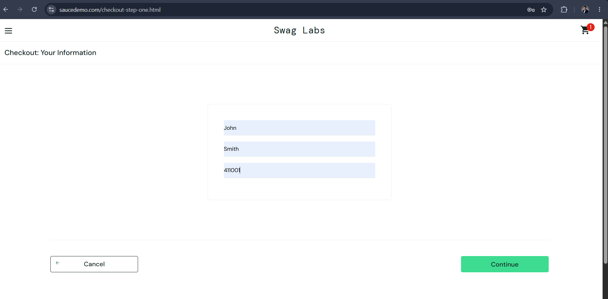
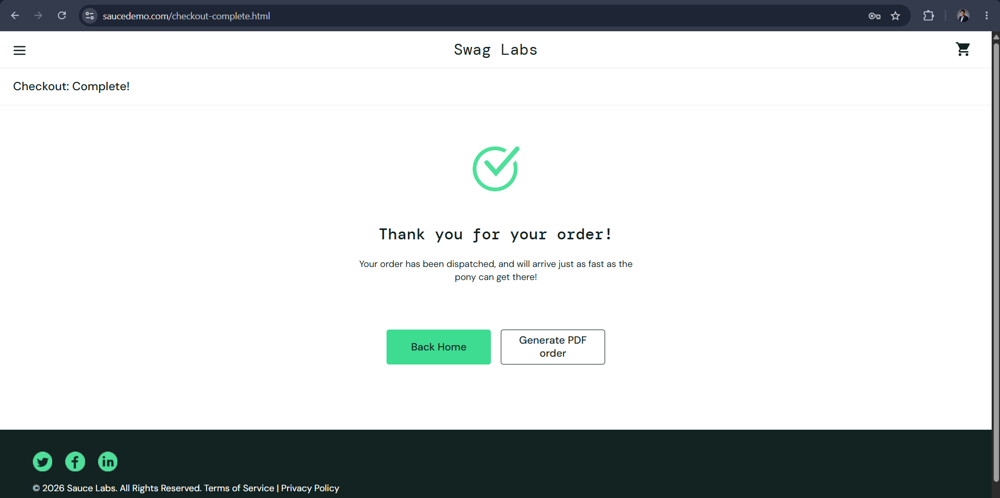
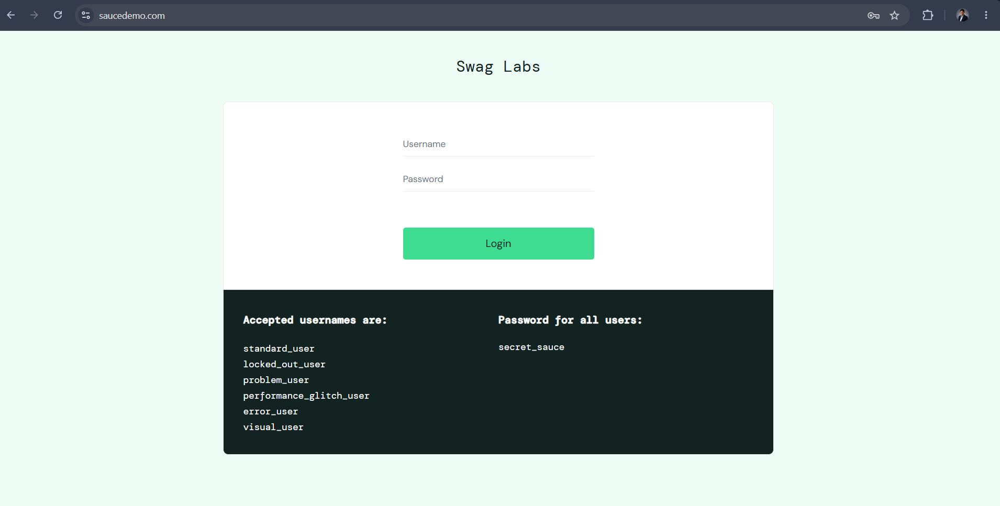

# SauceDemo End-to-End Manual Testing Project


## Project Overview

This project demonstrates a complete **End-to-End Manual Testing** cycle for the **SauceDemo** web application. It was created as part of my QA learning journey to showcase practical manual testing skills using industry-standard documentation and testing practices.

The project covers the complete Software Testing Life Cycle (STLC), including test planning, test design, execution, defect reporting, traceability, metrics, and test summary reporting.

---

## Application Details

| Field | Details |
|--------|---------|
| Application | SauceDemo |
| URL | https://www.saucedemo.com/ |
| Testing Type | Manual Testing |
| Project Type | End-to-End Functional Testing |
| Tester | Swapnali Shitole |

---

## Project Objectives

The primary objectives of this project are to:

- Verify the core functionality of the SauceDemo application.
- Execute end-to-end user workflows.
- Prepare professional QA documentation.
- Practice manual testing techniques used in real-world software projects.
- Build a portfolio demonstrating industry-standard QA skills.

---

## Testing Scope

The following modules were included in testing:

- Login
- Product Listing
- Product Sorting
- Shopping Cart
- Checkout
- Navigation
- Logout

---

## Testing Types Performed

- Smoke Testing
- Functional Testing
- Exploratory Testing
- Positive Testing
- Negative Testing
- End-to-End Testing

---

## Project Structure

```text
SauceDemo-Testing/
│
├── README.md
├── 01-Test-Plan/
│   └── Test-Plan.md
├── 02-Test-Scenarios/
│   └── Test-Scenarios.md
├── 03-Test-Cases/
│   └── Test-Cases.md
├── 04-Test-Execution/
│   ├── Test-Execution-Report.md
│   └── Execution-Summary.md
├── 05-Bug-Reports/
│   └── Bug-Report.md
├── 06-Screenshots/
│   ├── Login-Page.png
│   ├── Inventory-Page.png
│   ├── Shopping-Cart.png
│   ├── Checkout-Page.png
│   ├── Checkout-Step-1.png
│   ├── Checkout-Step-2.png
│   ├── Required-Field-Validation.png
│   └── Logout-Page.png
├── 07-Test-Data/
│   └── Test-Data.md
├── 08-RTM/
│   └── Requirement-Traceability-Matrix.md
├── 09-Test-Metrics/
│   └── Test-Metrics.md
└── 10-Test-Summary/
    └── Test-Summary-Report.md
```

---

## Documentation

| Folder | Contents |
|---|---|
| [01-Test-Plan](./01-Test-Plan) | Test plan: scope, approach, and objectives |
| [02-Test-Scenarios](./02-Test-Scenarios) | High-level end-to-end test scenarios |
| [03-Test-Cases](./03-Test-Cases) | Detailed step-by-step test cases |
| [04-Test-Execution](./04-Test-Execution) | Execution report and results summary |
| [05-Bug-Reports](./05-Bug-Reports) | Defects logged during testing |
| [06-Screenshots](./06-Screenshots) | Screenshots captured during test execution |
| [07-Test-Data](./07-Test-Data) | Test data used across test cases |
| [08-RTM](./08-RTM) | Requirement Traceability Matrix mapping requirements to test cases |
| [09-Test-Metrics](./09-Test-Metrics) | Test coverage and execution metrics |
| [10-Test-Summary](./10-Test-Summary) | Final test summary report |

---

## Screenshots

A few captures from test execution — full set (8 screenshots) available in [06-Screenshots](./06-Screenshots).

<p>
  
  
  
</p>
<p>
  
  
  
</p>

---

## Deliverables

The project includes the following QA documents:

- Test Plan
- Test Scenarios
- Detailed Test Cases
- Test Execution Report
- Execution Summary
- Bug Report
- Test Data
- Requirement Traceability Matrix (RTM)
- Test Metrics
- Test Summary Report
- Screenshots

---

## Test Execution Summary

| Metric | Result |
|--------|-------:|
| Total Requirements | 10 |
| Total Test Scenarios | 35 |
| Total Test Cases | 35 |
| Executed Test Cases | 35 |
| Passed | 35 |
| Failed | 0 |
| Blocked | 0 |
| Defects Logged | 0 |
| Pass Rate | 100% |
| Requirement Coverage | 100% |

> **Note:** [`05-Bug-Reports/Bug-Report.md`](./05-Bug-Reports) contains a
> practice bug report demonstrating defect-documentation format and is not
> reflected in the Defects Logged count above, which reflects actual
> execution results against this application.

---

## Test Environment

| Item | Details |
|------|---------|
| Operating System | Windows 11 |
| Browser | Google Chrome (Latest) |
| Application | SauceDemo |
| Testing Type | Manual Testing |

---

## Tools Used

- Google Chrome
- GitHub
- Markdown (.md)
- Microsoft Excel (for creating test artifacts before uploading to GitHub)

---

## Skills Demonstrated

This project demonstrates practical experience with:

- Manual Testing
- Smoke Testing
- Functional Testing
- Exploratory Testing
- Test Planning
- Test Scenario Design
- Test Case Design
- Test Execution
- Defect Reporting
- Requirement Traceability Matrix (RTM)
- Test Metrics
- Test Summary Reporting
- Software Testing Documentation
- GitHub Portfolio Management

---

## Key Learning Outcomes

Through this project, I gained hands-on experience in:

- Creating professional QA documentation.
- Designing comprehensive test scenarios and test cases.
- Executing manual tests against a real web application.
- Recording and reporting test execution results.
- Preparing requirement traceability matrices.
- Measuring testing progress using QA metrics.
- Organizing testing artifacts in a structured GitHub repository.

---

## Future Improvements

Potential enhancements for this project include:

- API Testing using Postman
- SQL Validation
- Cross-Browser Testing
- Mobile Browser Testing
- Accessibility Testing
- Automation Testing using Selenium WebDriver
- CI/CD Integration with GitHub Actions

---

## Conclusion

This project represents a complete manual testing workflow following industry best practices. It demonstrates my understanding of the Software Testing Life Cycle (STLC), QA documentation standards, and end-to-end functional testing using a real-world demo application.

It serves as a practical portfolio project that reflects my ability to plan, design, execute, and document software testing activities in a structured and professional manner.

---

## Author

**Swapnali Shitole**

Aspiring QA Engineer | Manual Testing | Software Testing | GitHub Portfolio Development
