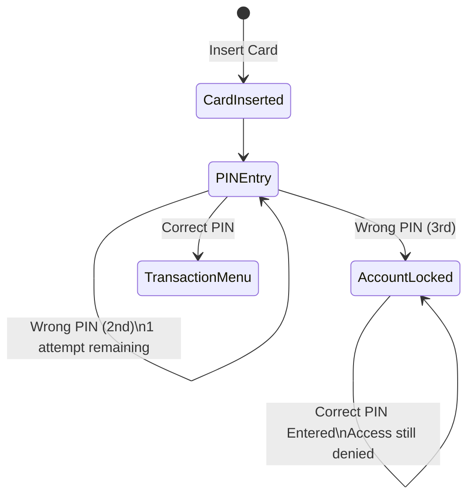

# State Transition Testing

*Part of [Test-Design-Techniques](./README.md) — theory: [07-Notes/02-Test-Design-Techniques-Theory.md](../../07-Notes/02-Test-Design-Techniques-Theory.md)*

## ATM State Transition

### Requirement

The ATM allows a maximum of **three incorrect PIN attempts**.

After the third incorrect attempt, the account is locked.

Even if the correct PIN is entered after the account is locked, access should remain blocked until the account is unlocked by the bank.

---

## States

- Card Inserted
- PIN Entry
- Account Locked
- Transaction Menu

---

## State Transition Table

| Current State | Event | Next State | Expected Result |
|---------------|-------|------------|-----------------|
| PIN Entry | 1st Incorrect PIN | PIN Entry | Display "Incorrect PIN. Try Again." |
| PIN Entry | 2nd Incorrect PIN | PIN Entry | Display "Incorrect PIN. 1 Attempt Remaining." |
| PIN Entry | 3rd Incorrect PIN | Account Locked | Display "Account Locked." |
| Account Locked | Correct PIN Entered | Account Locked | Access Denied. User cannot proceed. |

---

## State Transition Diagram

*Note: once `AccountLocked` is reached, no transition leads back to `PINEntry` or `TransactionMenu` — the diagram deliberately shows the account staying locked even on a correct PIN, since only the bank can unlock it.*

---

## Test Cases

| Test Case ID | Scenario | Expected Result |
|--------------|----------|-----------------|
| TC-ST-001 | Enter wrong PIN once | Retry allowed |
| TC-ST-002 | Enter wrong PIN twice | Retry allowed with warning |
| TC-ST-003 | Enter wrong PIN three times | Account Locked |
| TC-ST-004 | Enter correct PIN after account lock | Login denied |

---

## Conclusion

State Transition Testing verifies that the ATM changes states correctly based on user actions. It ensures security by locking the account after three consecutive incorrect PIN entries.
