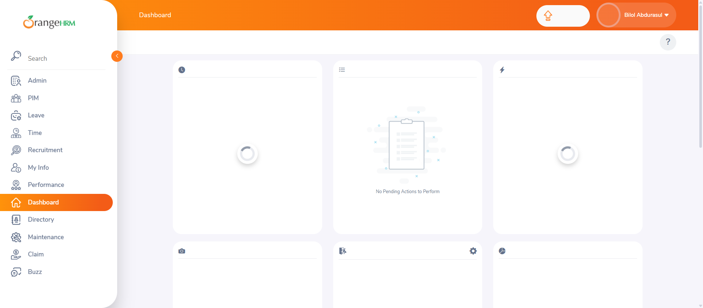
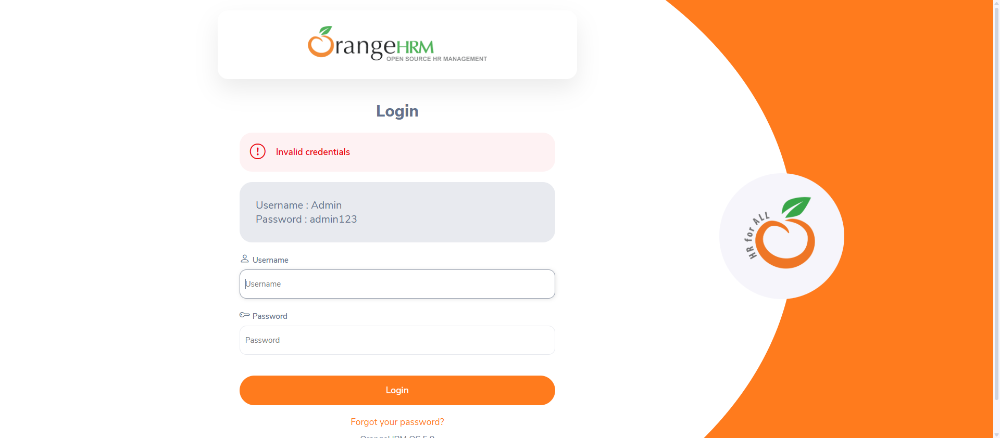
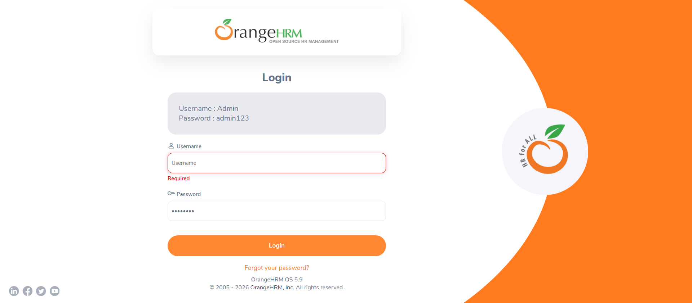

# OrangeHRM Login Automation

*Status: 4 test cases automated and passing, with execution screenshots.*

Automates the login test cases already documented manually in
[`06-Projects/OrangeHRM-Login-Testing`](../../06-Projects/OrangeHRM-Login-Testing),
using Java, Selenium WebDriver, TestNG, and the Page Object Model.

---

## Project Structure

```text
05-OrangeHRM-Automation-Project/
│
├── README.md
├── pom.xml
├── src/
│   ├── main/java/pages/LoginPage.java
│   └── test/java/tests/LoginTest.java
└── screenshots/
    ├── TC001_Dashboard_Success.png
    ├── TC002_InvalidPassword_Alert.png
    ├── TC003_EmptyUsername_Validation.png
    └── TC004_EmptyPassword_Validation.png
```

---

## Test Cases Automated

| TC ID | Scenario | Automated? |
|---|---|---|
| TC-001 | Valid login redirects to dashboard | ✅ Passing |
| TC-002 | Invalid password shows an error | ✅ Passing |
| TC-003 | Empty username shows validation | ✅ Passing |
| TC-004 | Empty password shows validation | ✅ Passing |
| TC-005 | Password masking | ⏳ Planned |
| TC-007 | SQL injection attempt rejected safely | ⏳ Planned |

Full manual test case list:
[06-Projects/OrangeHRM-Login-Testing/03-Test-Cases](../../06-Projects/OrangeHRM-Login-Testing/03-Test-Cases).

---

## Execution Screenshots

<p>
  
  
</p>
<p>
  
  
</p>

---

## How to Run

1. Install Java (JDK 11+) and Maven.
2. Clone this repo and navigate to this folder.
3. Run: `mvn test`
4. Chrome will open automatically (via WebDriverManager) and execute each test.
5. Screenshots are saved automatically to `screenshots/` after each test.

> **Note:** Locators in `LoginPage.java` were written against the OrangeHRM
> demo site's structure at the time of writing. If a test fails
> unexpectedly, inspect the live page first — the demo site's HTML can
> change between updates.

---

## What This Demonstrates

- Translating existing manual test cases into automated scripts
- Page Object Model structure (locators/actions separated from test logic)
- TestNG annotations, assertions, and test prioritization
- Explicit waits for reliable element interaction — including fixing a
  timing issue by waiting for the URL *and* the dashboard header to render,
  rather than checking immediately after clicking Login
- Programmatic screenshot capture on test execution (`TakesScreenshot`)

---

## Next Steps

- Add remaining test cases (password masking, lockout, security)
- Generate and add a TestNG HTML execution report
- Move hardcoded test data into a separate test data file
- Add a GitHub Actions workflow to run tests automatically on push
