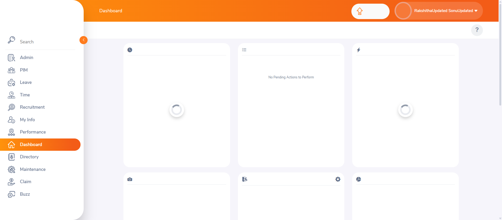
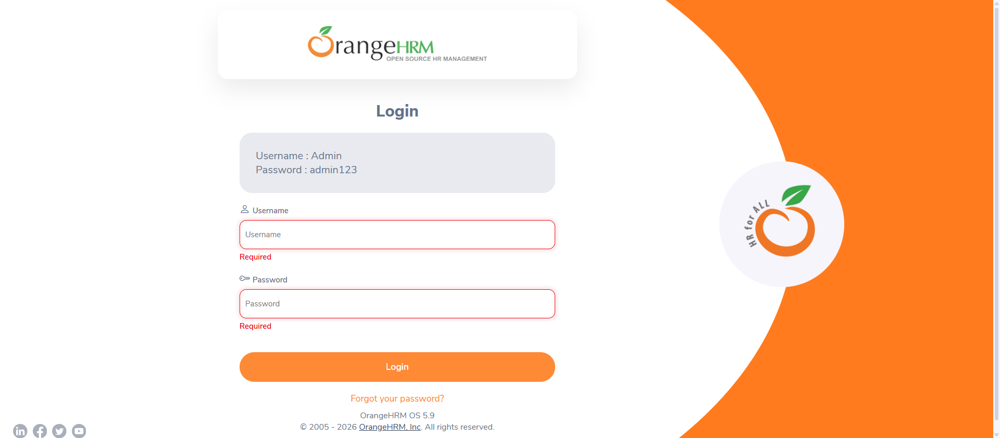
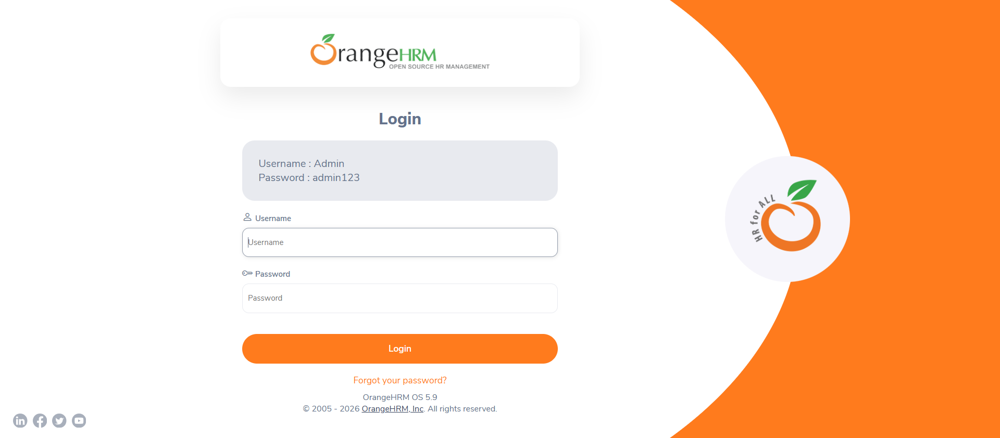

# OrangeHRM Login Automation

*Status: 8 test cases automated and passing, with execution screenshots.*

Automates the login test cases already documented manually in
[`06-Projects/OrangeHRM-Login-Testing`](../../06-Projects/OrangeHRM-Login-Testing),
using Java, Selenium WebDriver, TestNG, and the Page Object Model.

---

## Project Structure

```text
05-OrangeHRM-Automation-Project/
│
├── README.md
├── pom.xml
├── src/
│   ├── main/java/pages/LoginPage.java
│   └── test/java/tests/LoginTest.java
└── screenshots/
    ├── TC005_Dashboard_Success.png
    ├── TC006_InvalidPassword_Alert.png
    ├── TC008_EmptyUsername_Validation.png
    ├── TC009_EmptyPassword_Validation.png
    ├── TC010_BothFieldsEmpty_Validation.png
    ├── TC011_Password_Masking.png
    ├── TC012_Logout_Success.png
    └── TC018_SpecialChars_Username_Alert.png
```

---

## Test Cases Automated

TC IDs match
[Login-Test-Cases.md](../../06-Projects/OrangeHRM-Login-Testing/03-Test-Cases/Login-Test-Cases.md)
exactly. "Priority" is the TestNG execution order (`@Test(priority=...)`), not the TC ID.

| TC ID | Scenario | Priority | Status | Visual Evidence |
|---|---|:-:|---|---|
| TC-005 | Valid login redirects to dashboard | 1 | ✅ Passed | [Screenshot](screenshots/TC005_Dashboard_Success.png) |
| TC-006 | Invalid password shows an error | 2 | ✅ Passed | [Screenshot](screenshots/TC006_InvalidPassword_Alert.png) |
| TC-008 | Empty username shows validation | 3 | ✅ Passed | [Screenshot](screenshots/TC008_EmptyUsername_Validation.png) |
| TC-009 | Empty password shows validation | 4 | ✅ Passed | [Screenshot](screenshots/TC009_EmptyPassword_Validation.png) |
| TC-010 | Both username and password empty | 5 | ✅ Passed | [Screenshot](screenshots/TC010_BothFieldsEmpty_Validation.png) |
| TC-011 | Password masking verification | 6 | ✅ Passed | [Screenshot](screenshots/TC011_Password_Masking.png) |
| TC-012 | Logout redirects back to login page | 7 | ✅ Passed | [Screenshot](screenshots/TC012_Logout_Success.png) |
| TC-018 | Special characters in username rejected safely | 8 | ✅ Passed | [Screenshot](screenshots/TC018_SpecialChars_Username_Alert.png) |

Full manual test case list:
[06-Projects/OrangeHRM-Login-Testing/03-Test-Cases](../../06-Projects/OrangeHRM-Login-Testing/03-Test-Cases).

---

## Execution Screenshots

<p>
  
  
</p>
<p>
  
  
</p>
<p>
  
  
</p>
<p>
  
  
</p>

---

## How to Run

1. Install Java (JDK 11+) and Maven.
2. Clone this repo and navigate to this folder.
3. Run: `mvn test`
4. Chrome will open automatically (via WebDriverManager) and execute each test.
5. Screenshots are saved automatically to `screenshots/` after each test.

> **Note:** Locators in `LoginPage.java` were written against the OrangeHRM
> demo site's structure at the time of writing. If a test fails
> unexpectedly, inspect the live page first — the demo site's HTML can
> change between updates.

---

## What This Demonstrates

- Translating existing manual test cases into automated scripts
- Page Object Model structure (locators/actions separated from test logic)
- TestNG annotations, assertions, and test prioritization
- Explicit waits for reliable element interaction — including waiting for
  the URL *and* the dashboard header to render, rather than checking
  immediately after an action
- Multi-element validation (counting required-field errors when both
  fields are empty, not just checking one exists)
- Attribute-level assertions (verifying the password field's `type`
  attribute for masking, not just visual appearance)
- A full login → dashboard → logout flow, not just the login form itself
- Security-adjacent negative input handling (special characters rejected safely)
- Programmatic screenshot capture on test execution (`TakesScreenshot`)

---

## Next Steps

- Automate remaining manual test cases: TC-013–TC-017 (session/browser behavior), TC-019, TC-020 (remaining security/negative cases)
- Generate and add a TestNG HTML execution report
- Move hardcoded test data into a separate test data file
- Add a GitHub Actions workflow to run tests automatically on push
